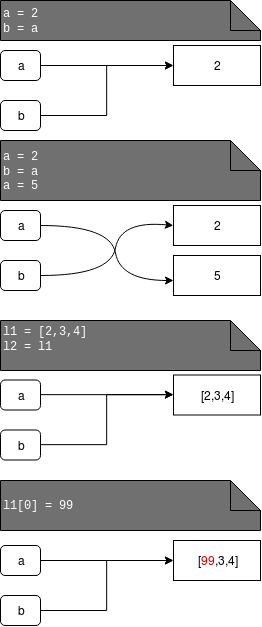

Syntax in python
****************

Syntax in python can be a bit strange for Java or C++ developers because:\n

* There is no semicolons ; at the end of line

.. code-block:: python
  
  print("example")

* Indents are necessary and can change a program behaviour but there is not a forced length of indent it can be a 1 space or 5 but it must be the same in whole file

.. code-block:: python

  list = [1,4,3,2,1,6]
  
  for x in list:
    if x > 3:
      print(x)

* Compiler will raise an error if you made any mistake in indentation:

:: 

  list = [1,4,3,2,1,6]
  for x in list:
    if x % 2 == 0:
        print(x)  # too much spaces here (4)
  >>>IndentationError: unindent does not match any outer indentation level 

* There is no need to name a type of variable in python, you can change a type of value in your code 

.. code-block:: python

  x = 2
  print(x)
  #>>>2
  x = "abc"
  print(x)
  #>>>abc

* Every variable is the reference to a object in memory but for small integers and short strings it behaves different that in other cases: Unfotunately there is no specified a behviour of references to small strings, it can beheaves differently on different interpreters

.. code-block:: python

  x = 20
  y = x
  y = 10
  print(x)
  #>>>20
  print(y)
  #>>>10

.. code-block:: python

  l1 = [1,2,3,4]
  l2 = l1
  l1[0] = 24
  print(l2)
  #>>>[24,2,3,4]

